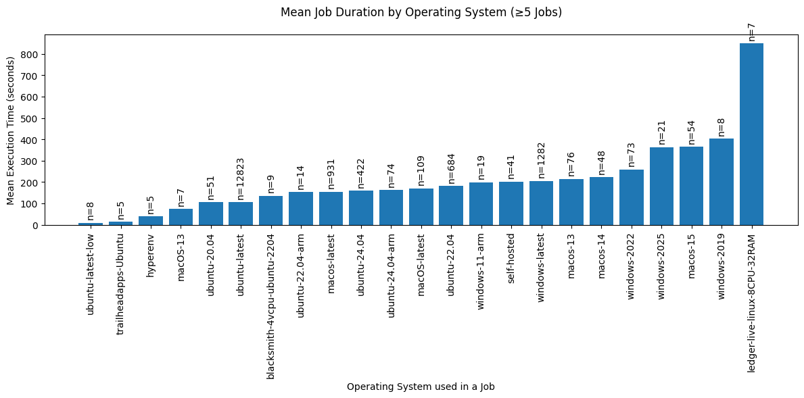
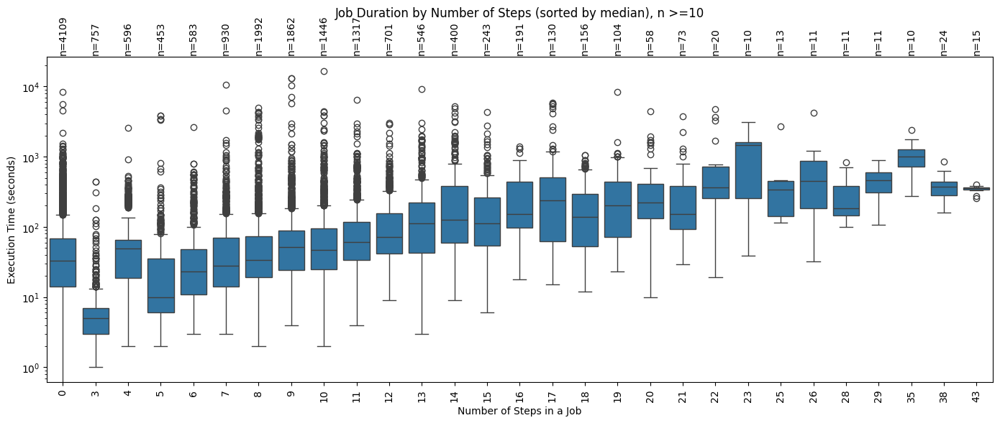
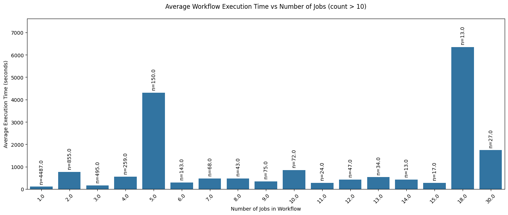

# JavaScript CI Activity Analysis

This project analyzes the GitHub Actions (CI) activity of JavaScript repositories with more than 10 stars.  
All required data files are included, no live API calls are needed to reproduce the analysis.

---

## Prerequisites

- **Python 3.9+**
- Install dependencies:
  ```bash
  pip install python-dotenv pandas matplotlib seaborn
  ```

* Create a `.env` file in the project root with your GitHub token:

  ```env
  GITHUB_TOKEN="ghpXXXXXXXXXXX"
  ```

---

## Data Collection & Processing

> All raw data and intermediate results are already included in this repository.
> In the notebook, lines marked `# API CALL TO *****` show where API calls originally occurred, but the code now reads from the saved files. No need to run these unless you specifically want.

### 1. Filter JavaScript Repositories

- Download the [SEART GitHub searcher datadump (August 2024)](https://www.dropbox.com/scl/fo/lqvp1mhsg0ezp2sgs0xdk/h?rlkey=j9joij3iqpy1zl5h061vdnlj6).
- Execute:

  ```sql
  SELECT COUNT(*)
  FROM git_repo
  WHERE language_id = "94453096"
    AND commits > 10
    AND last_commit > '2024-05-01 00:00:00';
  ```

  - `94453096` is the language ID for **JavaScript**.
  - Saved the output to `/files/git_repo_filtered_js_commit_date.csv`.
    **Total entries:** 24,612.

### 2. Identify Repositories with Workflows

- Use the GitHub GraphQL API to detect `.github/workflows` files for those filtered repositories.
  **Repositories found:** 12,215.

  - Stored in `/files/repos_with_workflow.txt`.

### 3. Download Workflow Files

- Download the workflow YAML files using the GitHub REST API.
  **Files downloaded:** 12,210.

  - Stored under `/workflow_files/{owner}/{repository}/`.

### 4. Retrieve Latest Workflow Runs

- Fetch latest workflow run metadata (workflow IDs, runner IDs, etc.) for all 12,210 repositories.

  - Repositories with executed workflows: 11,067.
  - Of these, **8,311** workflows were created by manual pull requests (not bots).

### 5. Fetch Job-Level Details

- Using each `runner_id` from workflow data, retrieve:

  - Jobs details including
    - start and end times
    - Operating system
    - Number of steps per job

- **Total jobs retrieved:** 20,528.

### 6. Preprocessing steps

- **Job data** (sourced from the GitHub API by querying jobs with their runner IDs)

  - Removed entries where `runner_name` was empty (indicating jobs that were never executed, possibly skipped, unscheduled, or unassigned).
  - Removed entries where the conclusion was not `"success"` to focus only on successful jobs.
  - Removed entries with invalid or missing `started_at` or `completed_at` timestamps.
  - Computed job execution time as `completed_at` – `started_at`.
  - Extracted operating system information from the `labels`, which contains the runner environment details.

- **Workflow data** (sourced from the GitHub API by retrieving the latest workflow run per repository)

  - Computed workflow `execution_time` as the difference between the earliest job `started_at` and the latest job `completed_at`.
  - Removed workflows with execution times exceeding 5 hours (outliers due to waiting/manual approvals).

### 7. Limitations and challenges

- The GitHub API had to be queried extensively at multiple stages (to collect repositories, workflows, jobs, and run metadata). This made the process time-intensive.
- Some jobs had inconsistent or missing metadata, requiring additional filtering.

### 8. Perform Analysis

- **Job level**

  - Execution time vs. operating system
  - Execution time vs. number of steps

- **Workflow level**

  - Total workflow execution time vs. number of jobs

### 9. Results

- Detailed analyses and visualizations are available in the included Jupyter notebook.

---

## Notes

- No live API calls required.
  The notebook loads all data from files for further analysis instead of hitting the GitHub API again and again.
- Run the Jupyter notebook to reproduce all analyses and visualizations.

## Visual Analysis

Below are the key visual insights derived from the cleaned datasets (`final_workflow_data.csv` and `workflow_job_data.csv`).

### 1. Mean Job Duration by Operating System



- **Observation:**
  - Linux-based runners (Ubuntu variants) are the most frequently used (e.g., `ubuntu-latest`, `ubuntu-20.04`) and show lower average execution times compared to Windows and macOS.
  - Windows runners (e.g., `windows-2022`, `windows-2019`) exhibit longer mean job durations, often 2–3× higher than Linux.
  - The `ledger-live-linux-8CPU-32RAM` runner stands out with the highest mean job duration, though its usage count is very small.

---

### 2. Job Duration by Number of Steps



- **Observation:**
  - Jobs with fewer steps (0–5) dominate the dataset (e.g., ≈4,109 jobs with 0 steps), showing relatively low median execution times, mostly under a few hundred seconds.
  - As the number of steps increases, the median execution time generally grows, with clear upward shifts around 10–20 steps.
  - Spikes at higher step counts (e.g., 23, 29 steps) indicate that some jobs with more steps take significantly longer to complete.
  - Extremely high execution times across many step counts suggest the presence of outliers, where certain steps involve complex or resource-heavy tasks that disproportionately increase duration.

---

### 3. Average Workflow Execution Time by Number of Jobs



- **Observation:**
  - Workflows with 1 job dominate the dataset (≈4,487), showing a median execution time of a few hundred seconds.
  - As the number of jobs increases, the average execution time generally grows, with spikes at 5 jobs and 18 jobs, indicating that some workflows with more jobs take significantly longer to complete.
  - Extremely high execution times for certain job counts suggest outliers where complex jobs or resource-heavy tasks increase duration.

---

## Summary of Findings

- **Workflow Complexity:**  
  Workflows with more jobs or steps tend to run longer, although efficient parallelism can sometimes offset the increase.

- **Operating System Impact:**  
  Linux runners are both more popular and faster, suggesting they are generally more efficient for CI tasks compared to Windows or macOS.

These insights can help optimize CI configurations by:

- Reducing unnecessary job steps,
- Favoring Linux-based runners when possible, and
- Splitting large workflows into more manageable jobs.
